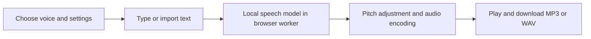

<p align="center">
  <a href="https://fluxnote.io">
    
  </a>
</p>

# Free Text to Speech — FluxNote

Turn written words into natural-sounding **English speech** with a free, open-source web app. Choose a voice, adjust its pacing, and download **MP3 or WAV** audio generated on your own device.

<a href="https://fluxnote.io">
  
</a>

<p align="center">
  <strong><a href="https://fluxnote.io">Start creating free ↗</a></strong>
  &nbsp; &nbsp; · &nbsp; &nbsp;
  <a href="#quick-start">Generate speech locally</a>
  &nbsp; &nbsp; · &nbsp; &nbsp;
  <a href="https://fluxnote.io/developers">FluxNote API documentation</a>
</p>

<p align="center">
  <strong>Follow FluxNote</strong><br /><br />
  <a href="https://www.instagram.com/fluxnote.io/" title="FluxNote on Instagram"></a>
  &nbsp;
  <a href="https://www.tiktok.com/@fluxnote" title="FluxNote on TikTok"></a>
  &nbsp;
  <a href="https://www.youtube.com/@fluxnote" title="FluxNote on YouTube"></a>
  &nbsp;
  <a href="https://x.com/fluxnote_" title="FluxNote on X"></a>
  &nbsp;
  <a href="https://www.linkedin.com/company/fluxnote" title="FluxNote on LinkedIn"></a>
</p>

**Free local generation, no paid speech API.** Your text is processed in a browser worker with Kokoro, an open-weight speech model. No account or API key is required. Model and runtime downloads need an internet connection; generating speech uses your device’s processing power.

## What it does

- Provides 12 American and British English voices with voice-type filters and name search.
- Accepts typed text, pasted text, and UTF-8 `.txt` imports.
- Previews a voice sample or the first 180 characters of your text.
- Generates up to 3,000 characters per request, in bounded passages.
- Adjusts speaking speed from 0.5× to 1.5× and pitch from −6 to +6 semitones.
- Exports MP3 at a requested 128 kbps, or uncompressed mono PCM WAV.
- Shows model download and passage progress, supports cancellation, and retains the latest five results in the current page.
- Includes an optional autoplay setting, light/dark themes, responsive layout, usage guide, and FAQs.



This version supports English only. It does not clone voices, translate text, or produce subtitles.

## Quick start

Requirements: **Node.js 22.13+**, **npm**, and an updated browser supporting WebAssembly and module workers. A desktop browser is recommended for the model’s memory needs.

Open a terminal in the project’s root directory.

### Install the app

```bash
npm ci
```

Installation copies ONNX runtime assets into `public/onnx`. If your npm configuration skips installation scripts, run:

```bash
node scripts/copy-runtime.mjs
```

### Start your speech studio

```bash
npm run dev -- --port 3200
```

Open [localhost:3200](http://localhost:3200).

### Create your first audio file

1. Select a voice in **Voice settings**.
2. Enter text, import a `.txt` file, or click **Try an example**.
3. Click **Preview voice** with an empty editor to hear a sample, or **Preview text** to hear the beginning of your passage.
4. Choose **MP3** or **WAV**, then click **Generate speech**.
5. Listen to the result and download the file before closing the page.

The first run downloads model and runtime assets that can exceed 100 MB in total. Downloads can be cached by the browser, subject to its storage policies. No speech inference is performed on a paid server.

## Settings you can customize

| Setting | Options | Purpose |
| --- | --- | --- |
| Language & accent | All English, American, British | Filter the voice list |
| Voice type | All, Female, Male | Filter by the model’s voice categories |
| Voice search | Voice name | Find a particular voice |
| Speed | 0.5×–1.5×; default 1× | Control generated pacing |
| Pitch | −6 to +6 semitones; default 0 | Resample audio to shift its pitch |
| Format | MP3 or WAV; default MP3 | Choose compressed or uncompressed output |
| Autoplay | On or off | Automatically play completed generations |

Pitch adjustment also changes duration: raising pitch makes the audio shorter; lowering pitch makes it longer. It is not a duration-preserving pitch effect. Voice previews always play when ready if the browser permits autoplay, and use WAV internally.

## Available voices

| Accent | Female voices | Male voices |
| --- | --- | --- |
| American English | Heart, Bella, Nicole, Sarah, Sky | Michael, Fenrir, Puck |
| British English | Emma, Isabella | George, Fable |

The voice descriptions in the interface are listening guides. Preview a voice to decide whether it suits your content.

## Text input and limits

- Up to **3,000 characters** per generation.
- Import plain-text `.txt` files under **50 KB**; imported text must also fit the character limit.
- SSML, PDF, Word, and rich-text formats are not supported.
- Text is split into passages of at most 180 characters to avoid truncation by the model. Extra-long unbroken strings are rejected.
- Whitespace is normalized; punctuation helps guide delivery. A short pause separates generated passages.
- One generation runs at a time. Cancellation terminates the worker; the next run reloads the engine, using cached assets where available.

## Privacy and storage

Your input text is used locally and is not sent to a speech API. The app fetches model/tokenizer files from Hugging Face and voice files from the voice host used by Kokoro.js. Those services receive ordinary asset requests and associated network metadata, not the text you entered. ONNX runtime files are served by the app.

Audio and settings are kept in page memory. There is no account, database, or cloud audio library. Only the five latest full generations are retained; previews are separate. Download anything you want to keep before refreshing, closing the page, or generating more results. Theme and settings reset on refresh.

## Troubleshooting

| Problem | What to try |
| --- | --- |
| The first run seems slow | Allow the model download to complete. Progress covers individual asset downloads, followed by local model initialization. |
| A model download fails | Check connectivity and whether your network or browser blocks Hugging Face or the voice asset host. |
| The speech worker cannot start | Reload in an updated desktop browser and ensure the local app is still running. |
| Generation fails or the tab runs out of memory | Shorten the passage and close memory-heavy tabs. Mobile device support varies. |
| There is no automatic playback | Press play in the audio controls; browser autoplay policies can block automatic audio. |
| A name is pronounced unexpectedly | Try phonetic spelling or a different voice. Pronunciation varies by input and model. |
| A file cannot be imported | Save it as UTF-8 plain text with a `.txt` extension and check both size and character limits. |
| The runtime files are missing | Run `node scripts/copy-runtime.mjs` and reload. |

## Test without paid APIs

```bash
npx tsc --noEmit
node scripts/test-audio.mjs
npm run build
```

The audio checks cover full text coverage during splitting, chunk limits, pitch frequency and duration, PCM clipping, WAV headers, and MP3 encoding. They run without model downloads.

For an optional real speech integration check:

```bash
node scripts/test-speech.mjs
```

This downloads the free quantized model into `.model-cache`, generates a short sample locally using the CPU runtime, checks for valid non-silent audio, and writes `outputs/speech-test.wav`. It validates model inference, not browser interaction or browser-worker integration. No paid API or credentials are required.

## Build and serve

```bash
npm run build
npm start
```

`npm start` serves the production build locally through Wrangler; follow the URL it prints. It does not publish the app. The interface uses React, TypeScript, Tailwind CSS, Zustand, and the Sites Vinext scaffold. Audio generation runs in a dedicated worker using Kokoro.js and a JavaScript MP3 encoder.

### Source download

With Python 3 installed:

```bash
python3 scripts/package-source.py
```

This refreshes `public/source.zip`, linked from the page’s open-source section. The ZIP is optional; the project is also an ordinary source folder suitable for Git. The archive excludes dependencies, model caches, generated audio, runtime binaries, and local secrets. After extracting, run `npm ci` to restore dependencies and runtime assets.

## Build something useful

Use this tool for video voiceovers, study notes, audiobook drafts, and spoken prototypes. Contributions can improve accessibility, pronunciation, language support, or resource use. Include a reproducible example and run the relevant checks.

Explore [FluxNote](https://fluxnote.io) for image and video creation, or read the [FluxNote developer documentation](https://fluxnote.io/developers) for hosted integrations.

**Ready to give your audio a visual story? [Create with FluxNote →](https://fluxnote.io)**

## License and support

[MIT](LICENSE) applies to this application’s code. FluxNote branding and trademarks remain the property of their owners. The speech model and JavaScript dependencies have their own licenses; see [THIRD_PARTY.md](THIRD_PARTY.md). Using this application does not grant rights to input text or waive other applicable rights.

For bugs, open an issue in the repository where you obtained this source. Include your OS, browser and Node versions, chosen settings, and a short non-sensitive reproduction. Never attach credentials or private text. Contact [support@fluxnote.io](mailto:support@fluxnote.io) for FluxNote account or billing questions.
